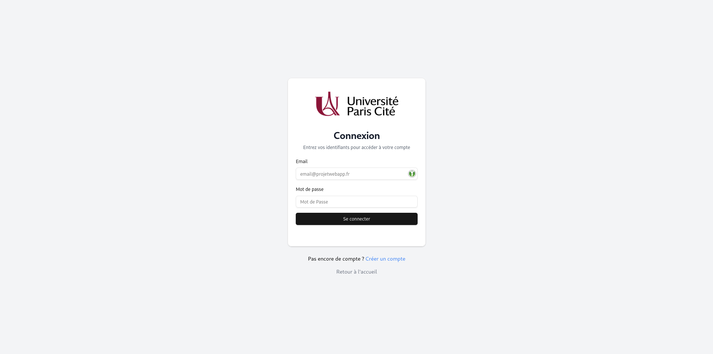
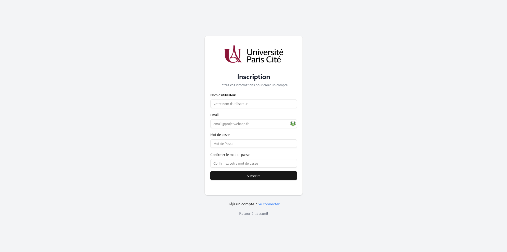
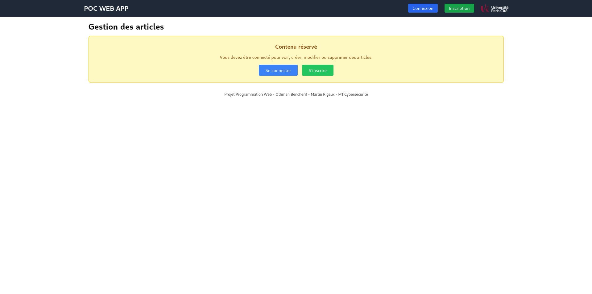
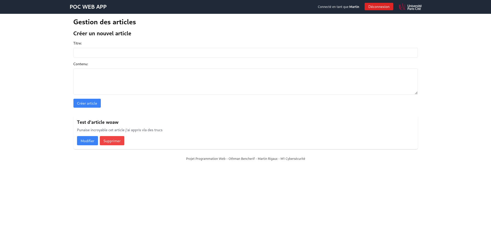
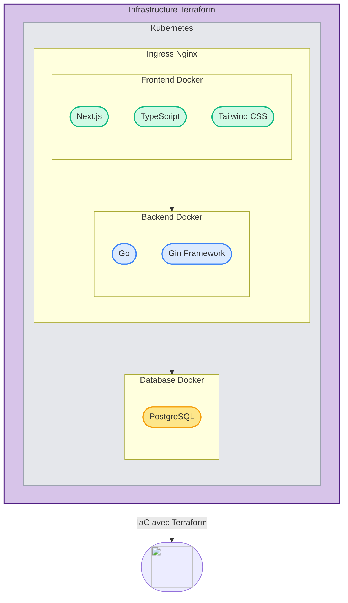
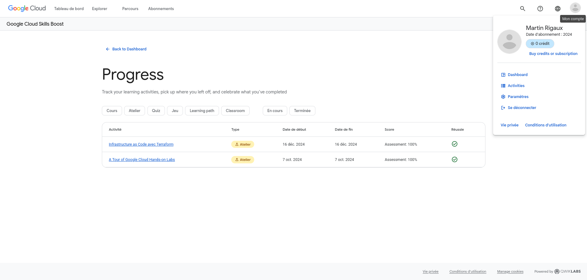

<center></center>

# Projet Programmation Web - M1 Cybersécurité

Othman BENCHERIF
Martin RIGAUX

## 1. Introduction

Notre projet est une application de gestion d'articles de presse permettant aux utilisateurs de créer, modifier et supprimer des articles. L'application possède une interface graphique écrite en Next.js.Le backend est divisé en deux partie. Une partie gestions des articles et une partie gestions authentification. Le tout est orchestré avec Kubernetes de manière sécurisée. 
## 2. Architecture Globale


### 2.1 Frontend (Next.js)
Nous avons décidés de coder le site internet en Typescript en utilisant le framework Next.js. L'un d'entre nous était familier avec ce framework ce qui à permis de nous décider.

Le site contient plusieurs pages, une page de connexion et d'enregistremment ainsi que la page principale de gestion des articles.

Pour la partie CSS, nous avons utilisé TailwindCSS, un framework nous permettant de coder plus rapidement en écrivant le CSS directement dans les balises html.  

Le front-end communique directement avec le back-end à l'aide de fonctions nous permettans de charger les données.

Nous avons créé plusieurs fonctions afin d'intéragier avec le back-end. Ces fonctions correspondent à l'acronyme **CRUD**:


| Fonction | Description | Type CRUD |
|----------|-------------|------------|
| _getArticles()_ | Récupère tous les articles | READ |
| _getArticle()_ | Récupère un article spécifique | READ |
| _createArticle()_ | Crée un nouvel article | CREATE |
| _updateArticle()_ | Met à jour un article existant | UPDATE |
| _deleteArticle()_ | Supprime un article | DELETE |

#### 2.1.1 Page de Connexion
Cette page est reliée directement au backend qui lui même est connecté à la base de données _Postgres_.

#### 2.1.2 Page d'enregistrement
Pareil que la page de connexion, cette page est reliée au backend qui va ensuite enregistrer le nouvel utilisateur dans la base de données. 


#### 2.1.3 Page d'accueil
La page d'accueil ne peut être accéder si l'utilisateur ne sait pas connecté. Il devra soit s'enregistrer via la page d'enregistrement, soit se connecter s'il possède déjà un compte. 



#### 2.1.4 Gestion des articles
Une fois que l'utilisateur s'est connecté il peut ajouter et supprimer des articles. Ils sont alors listés juste en dessous avec la possibilité de les modifier ou de les supprimer. Nous utilisons ici les fonctionnalités **POST** et **UPDATE** du backend.


### 2.2 Services Backend (Go)

#### 2.2.1 Service d'Articles API (Port 8080)

Ce service fournit un API afin de gérer des articles de presse. L'API correspond à l'acronyme **CRUD** afin de faciliter l'intéraction avec le front-end. Le service est relié directement à la base de données.

##### Routes pour les articles
| Route | Méthode | Description |
|-------|---------|-------------|
| `/articles` | GET | Récupérer tous les articles |
| `/articles/:id` | GET | Récupérer un article spécifique |
| `/articles` | POST | Créer un nouvel article |
| `/articles/:id` | PUT | Mettre à jour un article |
| `/articles/:id` | DELETE | Supprimer un article |

- Structure du code :
  - `backend/cmd/` : Point d'entrée de l'application
  - `backend/internal/` : Logique métier
  - `backend/pkg/` : Bibliothèques partagées
  - `backend/config/` : Configuration de l'application

#### 2.2.2 Service d'Authentification (Port 8081)
Ce service fournit une API pour que les utilisateurs s'inscrive sur le site web. Le service est connecté directement à la base de données afin d'enregistrer les données de façon permanent. 

##### Routes pour les utilisateurs
Les routes API sont les suivantes:
| Route | Méthode | Description |
|-------|---------|-------------|
| `/login` | POST | Tentative de connexion |
| `/validate-token` | POST | Validation du token de connexion si existant |
| `/users` | GET | Récupérer tous les utilisateurs |
| `/users/:id` | GET | Récupérer un utilisateur spécifique |
| `/users` | POST | Créer un nouvel utilisateur |
| `/users/:id` | PUT | Mettre à jour un utilisateur |
| `/users/:id` | DELETE | Supprimer un utilisateur |

- Structure du code :
  - `auth-service/models/` : Structures de données
  - `auth-service/handlers/` : Gestion des requêtes HTTP
  - `auth-service/middleware/` : Middleware d'authentification
  - `auth-service/repository/` : Accès aux données
  - `auth-service/routes/` : Définition des routes API

### 2.3 Infrastructure

Nous avons implémenté l'infrastructure comme demandé. Chaque service est implémenté via un module [Services](./k8s/services/) ainsi qu'un module [Deployments](./k8s/deployments/). 

Nous avons créé un namespace nommé `web-app` et sécurisé les échanges et l'accès aux services via Istio et RBAC. Durant le déploiement, le site est automatiquement sécurisé via Let's Encrypt qui créé un certificat SSL avec le nom de domain. 

L'accès au site se fait via un ingress controller qui redirige vers les requêtes vers les différents pods. 

Le secrets sont gérés par des ConfigMaps. Par exemple le mot de passe de la base de données _Postgres_ est hash est stocké dans un fichier ConfigMaps réservé. 

#### Diagramme de l'infrastructure complète


### 2.4. Déploiement

Nous avons configuré notre cluster de trois manières afin que vous puissiez si vous le souhaitez, déployer l'infrastructure sur votre ordinateur local.

La première possibilité est le déploiement à l'aide de `docker-compose`. Nous avons utilisé docker-compose afin de faire développer notre application web en local et que le backend, le frontend et la base de données soient connectés en même temps. A noter qu'ici nous n'utilisons pas les fichiers de configuration kubernetes mais bien un fichier `docker-compose.yaml` 

La deuxième est la possibilité de déploiement via _minikube_. Vous pouvez vous rendre dans le dossier `minikube` et éxecuter le fichier `create-cluster-local.sh`.

La troisième manière est de déployer le cluster via Terraform sur les serveurs AWS. Nous avons mis un place un pipeline **Github Actions** afin de déployer l'application à chaque fois qu'un push est fait sur la branche `main`. Le pipeline se connecte dans un premier temps aux serveurs d'AWS via un compte utilisateur. Il déploi ensuite l'infrastructure. Dans notre cas un cluster EKS (nom donné aux cluster Kubernetes sur AWS) avec un type de machine spécifique (t2.small). Ensuite notre configuration Kubernetes est mise en place via une suite de commandes lancées automatiquements sur le serveur distant. 

**Pour des raisons de budget, nous n'avons pas déployé le cluster en ligne.**

### 2.4.1 Environnement Local

Docker Compose pour le développement: [docker-compose.yaml](./docker-compose.yaml)

Se placer à la racine du dossier et executer la commande:
```
docker compose up -d --build
```
Vous pouvez ensuite accèder au site internet à l'adresse: `http://localhost:3000` et faire des requetes sur l'API à l'adresse: `http://localhost:8080/api/v1`.

### 2.4.2 Environnement Minikube

Script d'automatisation pour le déploiement: [create-cluster-local.sh](./minikube/create-cluster-local.sh)

Une fois le script executé, le cluster est totalement déployé en local. Vous pouvez y accèder via les mêmes liens que pour [Environnement Local](#241-environnement-local) juste au dessus.

### 2.4.3 Environnement Cloud
Infrastructure as Code avec Terraform: [terraform/](./terraform/)
Déploiement automatisé sur AWS: [.github/workflows/terraform.yml](./.github/workflows/terraform.yml?plain=1#L30)


## 3. Technologies Utilisées
Voici un récapitulatif des téchnologies utilisées pour notre application web. 
- **Frontend** : Next.js, TypeScript, Tailwind CSS
- **Backend** : Go, Gin Framework
- **Base de données** : PostgreSQL
- **Conteneurisation** : Docker
- **Orchestration** : Kubernetes
- **Service Mesh** : Istio
- **Infrastructure Cloud** : AWS, Terraform
- **Sécurité** : mTLS, RBAC

## Respect du cahier des charges

1. **Service Unique en Local (10/20)**

   - [x] Développement d'une mini-application backend.
   - [x] Création d'une image Docker via un `Dockerfile`.
   - [x] Créer un déploiement Kubernetes
   - [x] Créer un service Kubernetes
   - [x] Publication de l'image sur Docker Hub.

2. **Déploiement Kubernetes (12/20)**

   - [x] Configuration d'une **gateway** en local pour le routage via **Ingress** ou **Service Mesh**.

3. **Ajout de Services Supplémentaires (14/20)**

   - [x] Intégration d'un deuxième service backend.
   - [x] Communication entre les services via API et Service Mesh.

4. **Intégration d'une Base de Données (16/20)**

   - [x] Ajout d'une base de données SQL (MySQL/PostgreSQL) en local ou dans le cloud.
   - [ ] Possibilité d'accéder à un système de fichiers partagé via Kubernetes Volumes. (Optionnel)

5. **Sécurisation du Cluster**

   - [x] Implémentation des **RBAC** Kubernetes pour la gestion des accès.
   - [x] Chiffrement des échanges entre les services avec **mTLS** via Istio.
   - [x] Implémentation de HTTPs

6. **Déploiement Cloud (Optionnel) (18/20)**
   - [x] Déploiement de l'application dans une infrastructure cloud pour améliorer la scalabilité et la résilience.

##  Google Labs 
En plus de l'application web, il nous était demandé de faire des labs Google afin de valider des compétences. 

### Labs Martin RIGAUX
Comme demandé, j'ai terminé les deux labs à 100%. Le lab Terraform nous a été très utile pour la partie IaC du projet. 


## Critères d'évaluations (par ordre décroissant d'importance) :

- Intégration complète d'un maximum de technologies (Web Services, Docker, Kubernetes…)
- Codage
- Fonctionnalités
- Présentation (Front Office - CSS)

Pour les Cyber envoyer par mail à benoit.charroux@gmail.com
Faire un mini rapport pour que je comprenne ce que vous avez fait avec des copies d'écran de ce à quoi je dois m'attendre et des copies d'écran individuelles des Google labs (voir activitée de votre profil) le code sur Github ou Gitlab

**Date butoir de remise du projet fin avril**
